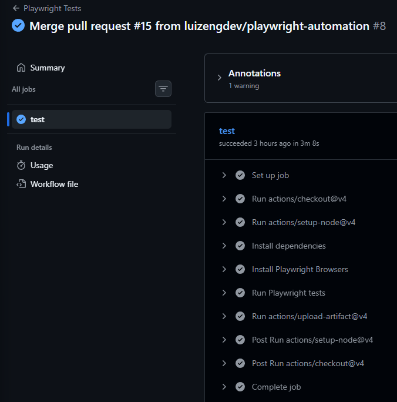
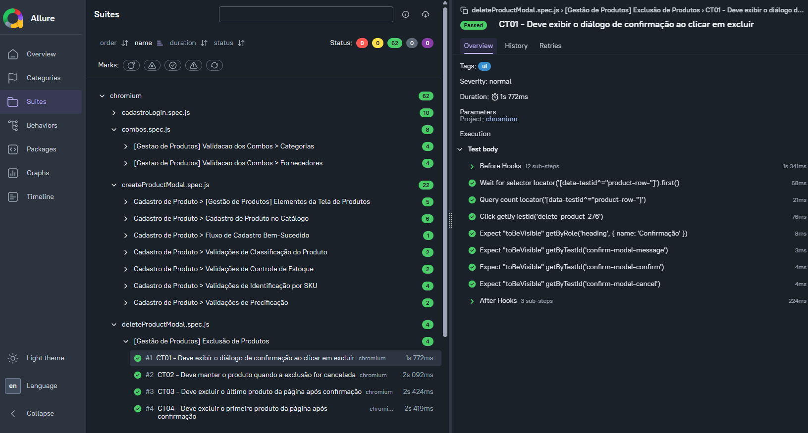
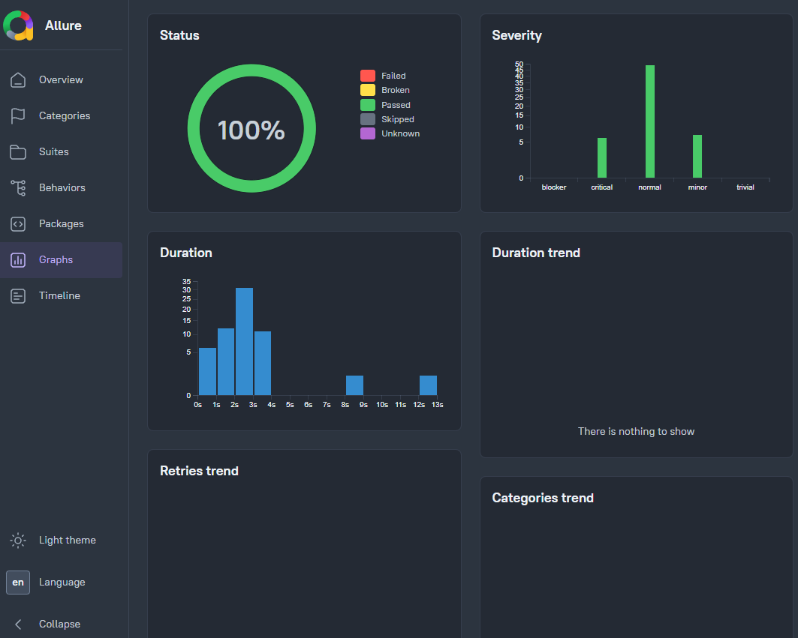
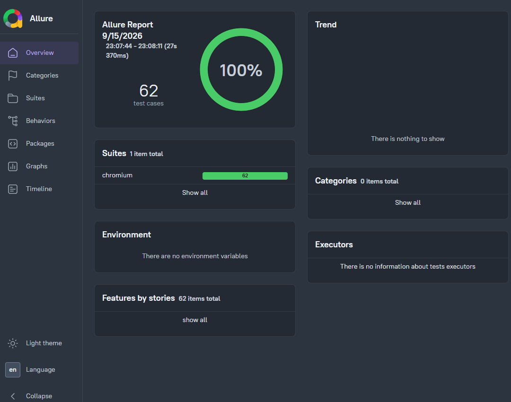

# 🚀 app-northwind | Projeto de Automação de Testes E2E com Playwright 🎭


> 💡 Este repositório é um projeto de estudo e desenvolvimento profissional em qualidade de software, com foco em automação de testes E2E. Como um documento vivo, ele continuará evoluindo conforme novos testes, cenários e melhorias forem adicionados.

---

## 📌 Sobre o Projeto

O projeto **app-northwind** foi criado para demonstrar práticas reais de automação de testes em uma aplicação web funcional, com foco em cenários de ponta a ponta (**E2E**) e validação de regras de negócio.

A solução foi construída com **Playwright** e **JavaScript puro**, aplicando boas práticas de organização, reutilização de código, testes de regressão e integração contínua. O objetivo principal é reforçar habilidades de engenharia de qualidade, testabilidade e confiabilidade de software em um ambiente próximo ao real.

Este projeto foi desenvolvido para compor um portfólio técnico sólido, mostrando domínio em automação, versionamento, estrutura de testes e execução em pipelines de CI/CD.

---

## 🛠️ Stack Tecnológica

| Ferramenta                                                                | Finalidade                                                                                  |
| :------------------------------------------------------------------------ | :------------------------------------------------------------------------------------------ |
| **[Playwright](https://playwright.dev/)**                                 | Framework principal para automação E2E, testes cross-browser e validação de interfaces web. |
| **[JavaScript](https://developer.mozilla.org/pt-BR/docs/Web/JavaScript)** | Linguagem base para criação dos testes, helpers e estrutura da automação.                   |
| **[Node.js](https://nodejs.org/)**                                        | Ambiente de execução do projeto e suporte à suíte de testes.                                |
| **[Git](https://git-scm.com/)**                                           | Controle de versionamento do código e histórico de evolução do projeto.                     |
| **[GitHub](https://github.com/)**                                         | Hospedagem do repositório e gestão do desenvolvimento em colaboração.                       |
| **[GitHub Actions](https://github.com/features/actions)**                 | Automação da execução dos testes em pipelines de CI/CD.                                     |

---

## ✅ Checklist de Implementação

- [x] Page Object Model — locators e ações encapsulados por responsabilidade
- [x] CRUD completo automatizado — cadastro, edição, exclusão e detalhes
- [x] Validação de campos obrigatórios e mensagens de erro
- [x] Validação de combos — fornecedores e categorias (existência + contagem exata)
- [x] Data Driven Testing com JSON e CSV
- [x] Massa de dados dinâmica com Faker.js
- [x] Evidências automáticas — screenshots e vídeos em falhas
- [x] Trace Viewer — investigação de falhas com timeline
- [x] Allure Report — relatórios com severity, epic e feature
- [x] CI/CD com GitHub Actions — pipeline automático a cada push e PR
- [x] Playwright Report como artifact no GitHub Actions

---

## 📸 Pipeline em Ação


[](https://github.com/luizengdev/app-northwind/actions/workflows/playwright.yml)

---

## 📊 Evidências do Allure Report

<div align="center">
  
</div>

<div align="center">
  
  
</div>

<p align="center">
  <b>Visão geral do relatório de execução, comportamento e histórico dos testes automatizados.</b>
</p>

---

## ⚙️ Como rodar localmente

### Pré-requisitos

- Node.js 20+
- Git

### Instalação

```bash
# Clonar o repositório
git clone git@github.com:luizengdev/app-northwind.git
cd app-northwind

# Instalar dependências
npm install

# Instalar navegador para execução local
npx playwright install chromium
```

### Variáveis de ambiente

Crie o arquivo `.env` na raiz do projeto com os dados abaixo:

```env
USER_EMAIL=seu-email@exemplo.com
USER_PASSWORD=sua-senha
BASE_URL=https://url-da-aplicacao.com
```

### Executar

```bash
# Todos os testes
npx playwright test

# Interface visual
npx playwright test --ui

# Execução de um arquivo específico
npx playwright test tests/createProductModal.spec.js

# Relatório HTML
npx playwright show-report

# Allure Report
npx allure generate allure-results && npx allure open
```

---

## 🔄 CI/CD

A pipeline executa automaticamente a cada **push** e **pull request** para a branch `main`.

O Playwright Report é gerado como **artifact** e fica disponível para download direto na aba **Actions**, permitindo análise rápida de falhas sem necessidade de execução local.

```yaml
on:
  push:
    branches: [main]
  pull_request:
    branches: [main]
```

---

## 📂 Estrutura do Projeto

```text
app-northwind/
├── .github/
│   └── workflows/
│       └── playwright.yml
├── components/
│   └── products/
│       ├── createProductModal.js
│       ├── EditProductModal.js
│       ├── DeleteConfirmationDialog.js
│       └── ProductDetailModal.js
├── docs/
│   ├── criterios-cadastro-produto.md
│   ├── criterios-cadastro-usuario.md
│   ├── criterios-detalhes-produto.md
│   ├── criterios-edicao-produto.md
│   └── criterios-exclusao-produto.md
├── fixtures/
│   ├── combo-categorias.json
│   ├── combo-fornecedores.json
│   ├── dados-cadastro-login.json
│   ├── login-data.json
│   ├── product-mass.csv
│   ├── products-data.json
│   └── ...
├── pages/
│   ├── cadastroPage.js
│   └── productsPage.js
├── tests/
│   ├── cadastroLogin.spec.js
│   ├── combos.spec.js
│   ├── createProduct.spec.js
│   ├── editProduct.spec.js
│   ├── deleteProduct.spec.js
│   └── ...
├── .gitignore
├── package.json
├── playwright.config.js
├── README.md
├── allure-results/
├── allure-report/
├── playwright-report/
├── screenshots/
├── test-results/
└── ...
```

---

## 🎯 Objetivos e Valor do Projeto

Este projeto foi pensado para evidenciar habilidades essenciais em QA Automation, incluindo:

- Validação de fluxos críticos do usuário
- Testes de regressão e estabilidade funcional
- Verificação de regras de negócio em ambiente real
- Organização do código com abordagem de Page Object Model
- Execução automatizada em pipeline CI/CD
- Geração de relatórios e evidências técnicas

Além disso, o projeto reforça a capacidade de transformar requisitos em testes automatizados, com foco em qualidade, rastreabilidade e confiabilidade.

---

## 🚀 Visão de Evolução

Este repositório representa uma base sólida para crescimento contínuo em automação de testes. Novos cenários, melhorias de estrutura, manutenção de rotina e expansão da suíte de testes podem ser incorporados ao longo do tempo, tornando o projeto cada vez mais completo e alinhado com práticas profissionais do mercado.

A evolução contínua deste projeto reflete um compromisso com aprendizado técnico, excelência em qualidade e desenvolvimento de competências relevantes para o setor de tecnologia.

---

<div align="center">
  <sub>Desenvolvido com 🎭 Playwright + ❤️ durante a formação Gotas de Tecnologia</sub>
</div>
